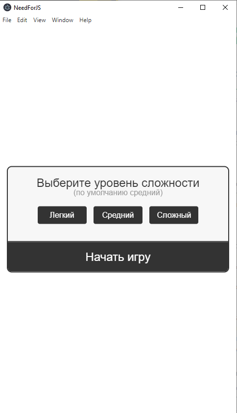
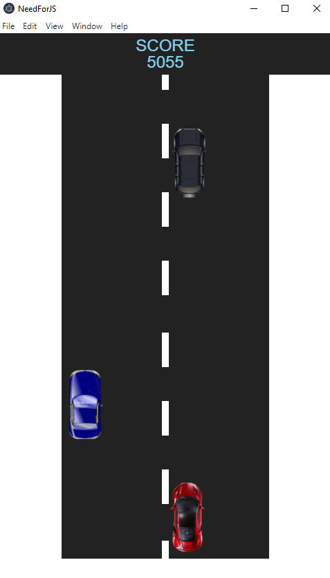
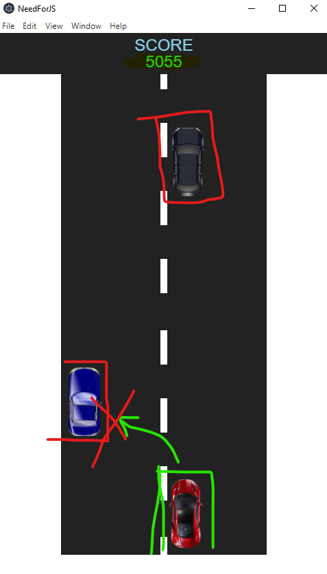
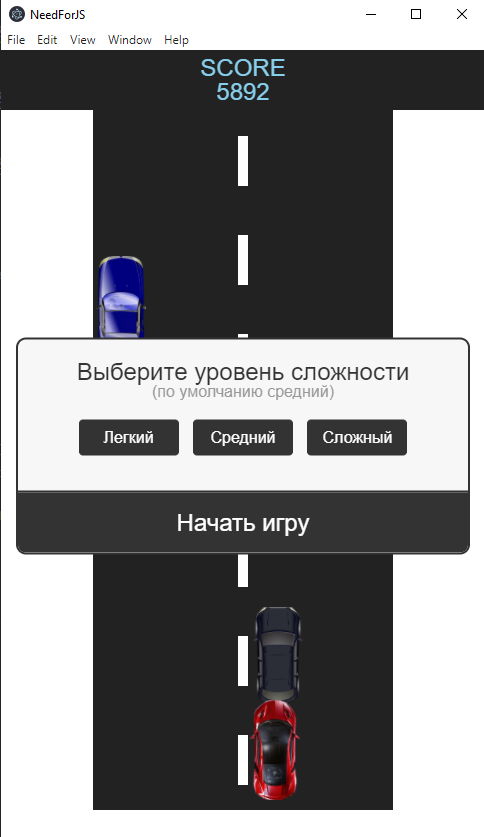
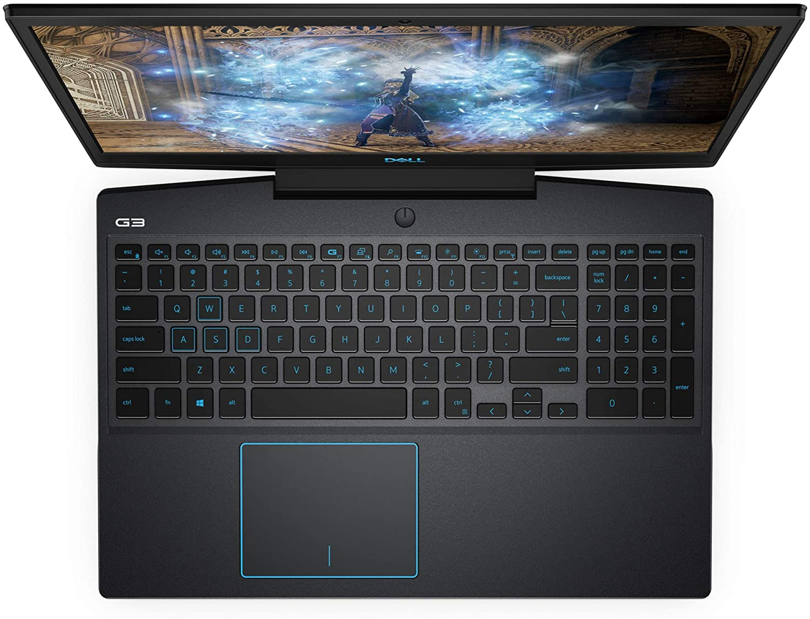

# racing-game
This is a racing game for Windows, written in pure JS, converted into an application with Electron js
# [](https://www.instagram.com/mr.crodo/)
# [](https://www.linkedin.com/in/mr-crodo/)
# [](https://t.me/mr_crodo)

**This repository is a full-fledged little game in the form of a desktop application.**


</td></tr></table>

<p align="center"><a href="#" target="_blank"></p>

[](https://nodejs.org/en/)
[](https://www.electronjs.org/)

[](https://github.com/electron/electron-packager)
[](https://www.npmjs.com/package/url)


Electron is a framework for building desktop applications using JavaScript, HTML, and CSS. By embedding Chromium and Node.js into its binary, Electron allows you to maintain one JavaScript codebase and create cross-platform apps that work on Windows, macOS, and Linux — no native development experience required..

## Description

The main goal of the project was to make a game out of html, css and native js that would **easily run** on desktops.

- The game is realized in `2D`.
- All the necessary photographs of the cars are already in the folder with `images` in `png` format.
- There is also music that runs along with the game, which is located in the `audio` folder
- Special JSX flags can be used during compile time to optimize runtime performance at application level
- Many micro optimizations

## Browser support

[](https://saucelabs.com/open_sauce/user/Havunen)


## Manual guides

- [To run, you must already have the node-js installed](https://nodejs.org/en/)
- [Also install ElectronJS](https://www.electronjs.org/)

## Code Example

To operate Electron, you need to create a JS file with a name different from the main program code

And write down the next set of commands:

```jsx
const url = require('url').format({
  protocol: 'file',
  slashes: true,
  pathname: require('path').join(__dirname, 'index.html')
});

```
Initialize Electron JS, And create a win object:

```jsx
const {app, BrowserWindow} = require('electron');

let win;
```

After that, we create a wrapper for our program with a width and a length createWindow () function that loads index.html into a new BrowserWindow instance

```jsx
function createWindow() {
  win = new BrowserWindow({
    width: 500,
    height: 850
  });

  win.loadURL(url);

  win.on('closed', function() {
    win = null;
  });
}
```

On Windows and Linux, exiting all windows will usually close the application completely.

To do this, listen for the app module's `'window-all-closed'` event and call `[app.quit ()] [app-quit]` if the user is not using macOS (darwin).

```jsx
app.on('ready', createWindow);

app.on('window-all-closed', function(){
  app.quit();
})

```


## Getting Started


Core package:

```sh
npm install 
```

To run the program:

```sh
# to run from terminal
npm start
```

To create a folder with a Windows application with an `.exe` extension, enter the following command :

```sh
# Creates a folder with a name `racing-game-win32-x64`
electron-packager .
```


## Game screenshots

<p align="center"><a href="#" target="_blank"></p>

<p align="center"><a href="#" target="_blank"></p>

<p align="center"><a href="#" target="_blank"></p>

<p align="center"><a href="#" target="_blank"></p>


### Sponsors

Support this project by becoming a sponsor. Your logo will show up here with a link to your website. [[Become a sponsor](https://opencollective.com/inferno#sponsor)]

<a href="#" style="border-radius: 10% 30% 50% 70%; overflow: hidden" target="_blank"></a>
<a href="https://www.jetbrains.com/ru-ru/" target="_blank"></a>
<a href="#" target="_blank"></a>
<a href="https://www.dell.ru/" target="_blank"></a>